# Creating an Office Scheduler with Amazon Lex and Twilio

1. Navigate to the Lex console
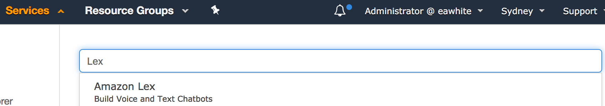 

1. Hit Create to create a new Lex bot
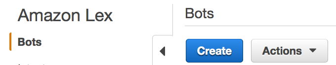 

1. You will then want to create a custom Lex bot with the following settings.
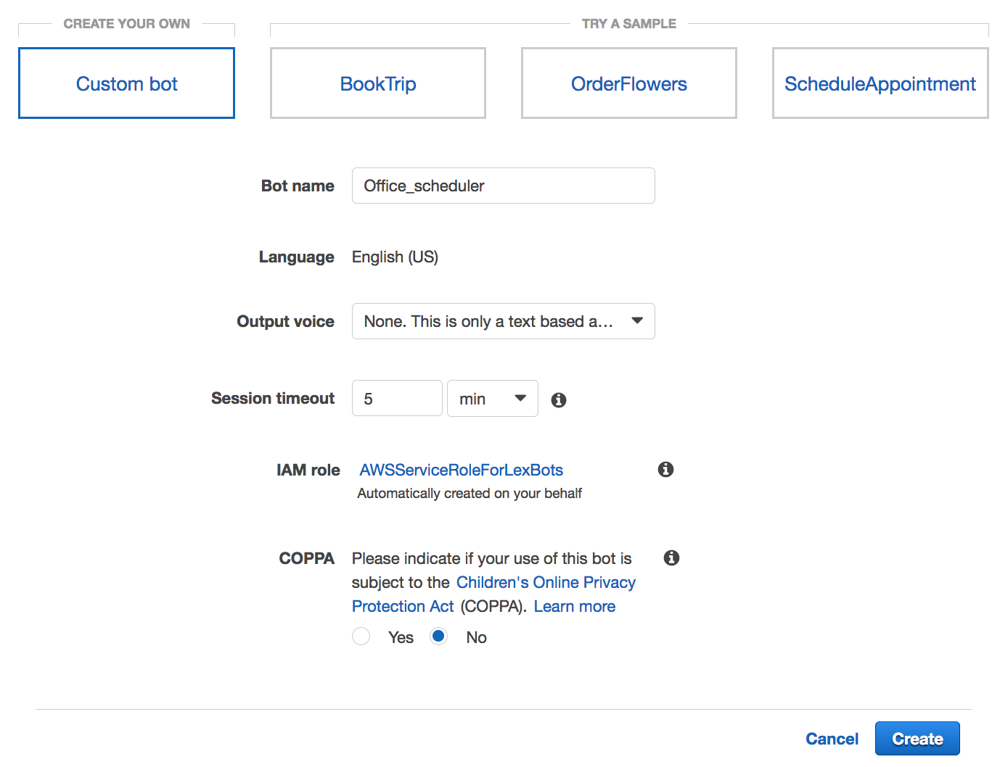 

1. Click "Create Intent", this will give your bot a motive.
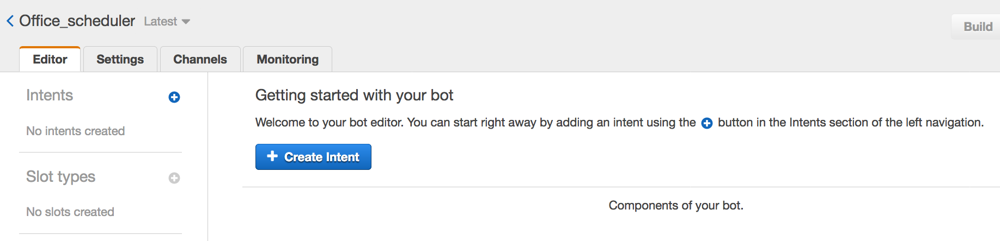 

1. Give your intent a name.
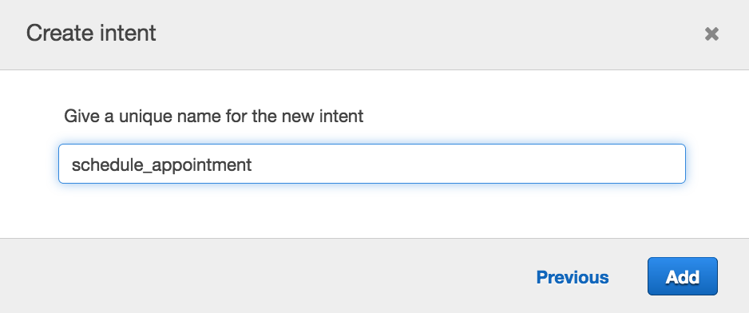 

1. Input some phrases that will trigger this intent, eg.
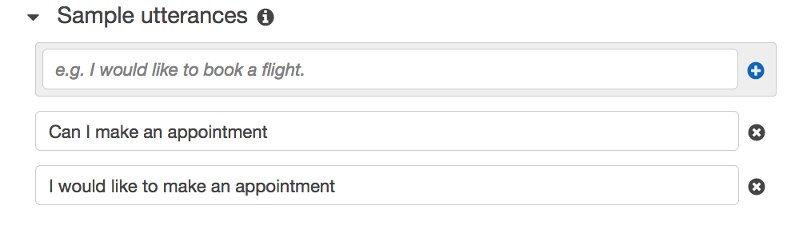 

1. Note that "time" and "date" slots are part of amazons default slot types. These are the only 2 slot types we are using today.
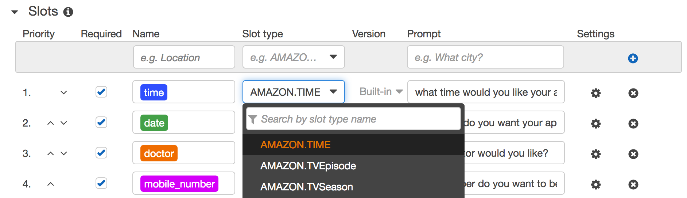 

1. You can now create your slots. Check the "required" check box for each slot. Use the following diagram as a guide.
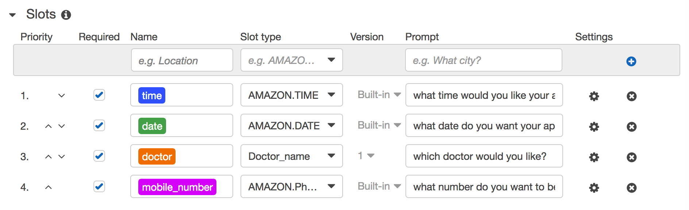 
The "time" slot was created with the slot type AMAZON.TIME, same with "date" slot. We will look at creating custom slot types in another session such as the other 2 you can see "doctor" and "mobile_number"

1. Put in a "one shot" utterance. This will enable users who are familiar with your bot to fill all "slots" in one utterance. You will see the slots, or minimum amount of info to fill the intent are "date" and "time".
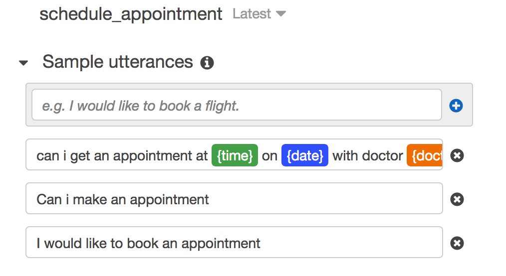 

1. At this stage we can test the bots interactions. Hit "Build" and see if there are any errors that need correcting.  
If the build is successful, test the conversation of your bot.
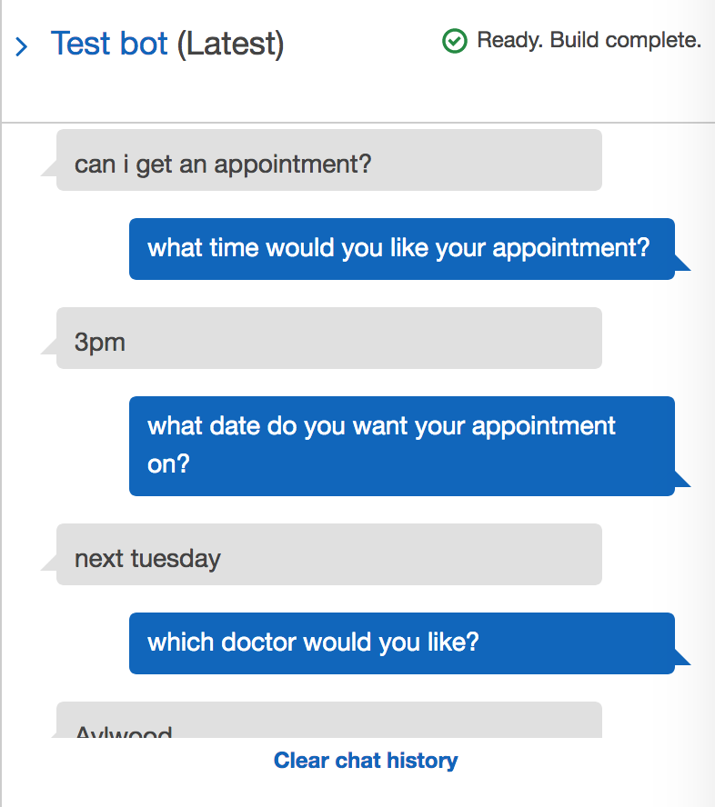 

1. You can now create a confirm prompt, which confirms with the user the details of the appointment are right.  
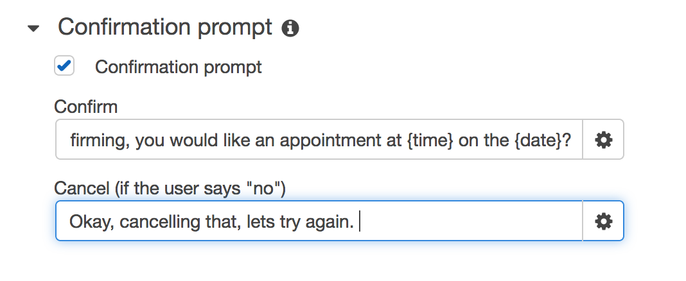 

1. Add a fulfillment prompt to confirm the users booking has been made.  
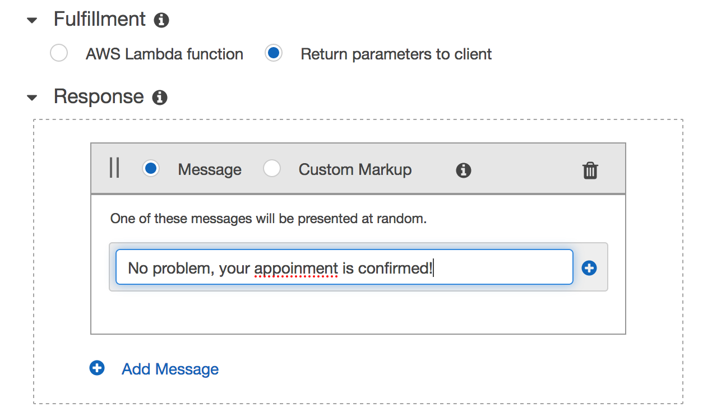 

hit Save Intent, re-Build your chat bot and re-test its conversation functionality as before.  
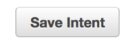 

You are Done!
